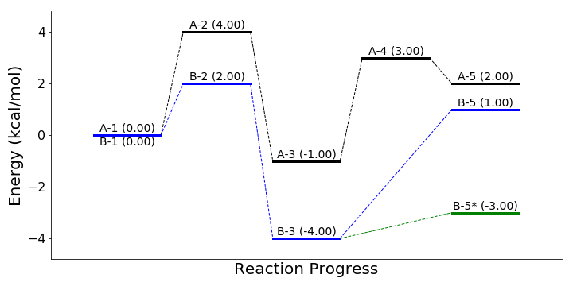

# rxnpath
Simple Python package that generates reaction diagrams

## Requires
```
- adjustText==0.7.3
- matplotlib==3.1.0
- networkx==2.3
- numpy==1.16.3
- python==3.6
```

## Installation
```bash
$ git clone https://github.com/ldgibson/rxnpath.git
$ cd rxnpath/
$ pip install .
```

## Example

```python
import numpy as np

from rxnpath import ReactionDiagram


energies1 = np.array([0, 4, -1, 3, 2])
labels1 = ['A-1', 'A-2', 'A-3', 'A-4', 'A-5']

energies2 = np.array([0, 2, -4, 1])
labels2 = ['B-1', 'B-2', 'B-3', 'B-5']

rxn = ReactionDiagram()

# Add pathways
rxn.add_pathway(labels1, energies1, name='A', color='black')
rxn.add_pathway(labels2, energies2, name='B', color='blue',
                positions=[0, 1, 2, 4])

# Add additional states not included in pathways
rxn.add_state(label='B-5*', energy=-3, position=4, edges=[('B-3', 'B-5*')],
              subgraph_name='B', color='green')

# Create diagram
rxn.plot_diagram(figsize=(10, 5), ylabel="Energy (kcal/mol)",
                 fontsize=14, show_energies=True)
```


